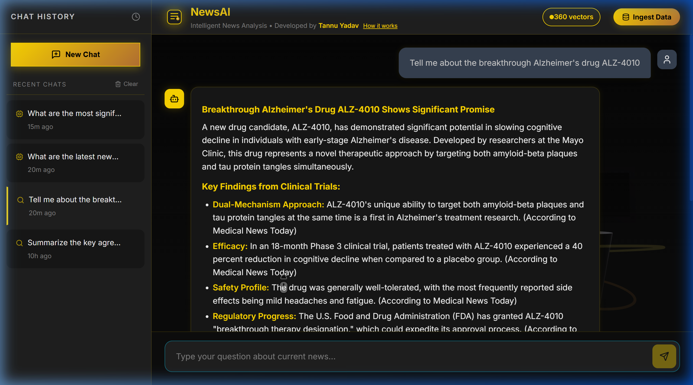

# 📰 NewsAI — Intelligent News Analysis Platform



**NewsAI** is a full-stack, AI-powered platform designed to perform deep, Retrieval-Augmented Generation (RAG) analysis on curated news datasets. Built with a premium 3D-immersive interface, it allows users to query breaking news, receive grounded answers with strict source citations, and generate structured executive-level insights.

## ✨ Core Features

*   **🔍 High-Fidelity RAG Pipeline**: Powered by LangChain and Google's Gemini API, the system vectorizes documents, performs semantic similarity searches, and generates factual answers strictly grounded in the provided dataset.
*   **📊 "Analyze with AI" Deep-Dive**: A specialized secondary pipeline that takes any chat response and breaks it down into a multi-tabbed modal containing: Detailed Explanations, Key Strategic Insights, Simplified Analogies, Historical Context, and Follow-up Questions.
*   **⚙️ Event-Driven Data Ingestion**: Uses **Inngest** for resilient background processing. It chunks large news datasets (800 tokens / 200 overlap), handles embedding API rate-limits via sequential backoff strategies, and persists high-dimensional vectors to a custom JSON-backed memory store.
*   **🌌 Premium 3D User Interface**: The frontend is built with React and Vite, featuring an interactive WebGL Three.js background (via React Three Fiber), glassmorphism design tokens, and smooth micro-animations.
*   **💾 Persistent Chat History**: Conversations are saved and can be instantly reloaded from the sidebar for continuous workflows.

---

## 🏗️ Architecture Stack

| Layer | Technology |
| :--- | :--- |
| **Frontend Core** | React 18, Vite, React Three Fiber, Vanilla CSS, Lucide Icons |
| **Backend API** | Node.js, Express.js |
| **AI & Orchestration**| LangChain, Gemini 2.5 Flash Lite, `gemini-embedding-001` |
| **Background Jobs** | Inngest (Event-Driven Pipeline) |
| **Vector Storage** | Local MemoryVectorStore with JSON Persistence |

---

## 🚀 Setup & Installation

### 1. Prerequisites
*   Node.js (v18 or higher)
*   A Google Gemini API Key (Get one from [Google AI Studio](https://aistudio.google.com/))

### 2. Clone & Install Dependencies
The project uses a monorepo structure. You need to install dependencies in the root, server, and client folders.

```bash
# Clone the repository
git clone https://github.com/tannu005/newsai.git
cd newsai

# Install root dependencies (concurrently)
npm install

# Install client dependencies
cd client
npm install

# Install server dependencies
cd ../server
npm install
```

### 3. Environment Configuration
Navigate to the `server/` directory and create a `.env` file (you can copy `.env.example` if available).

```env
# server/.env
GOOGLE_API_KEY=your_gemini_api_key_here
PORT=3001
VECTOR_STORE_PATH=./src/vectorstore
CHUNK_SIZE=800
CHUNK_OVERLAP=200
EMBEDDING_MODEL=gemini-embedding-001
LLM_MODEL=gemini-2.5-flash-lite
```

### 4. Running the Application
Return to the root directory of the project and run the unified dev script:

```bash
cd ..
npm run dev
```

This will concurrently start:
*   The **Vite Frontend** at `http://localhost:5173`
*   The **Express Backend** at `http://localhost:3001`

*(Optional)* To run the background ingestion pipeline locally, you can start the Inngest Dev Server in a separate terminal:
```bash
npx inngest-cli@latest dev -u http://localhost:3001/api/inngest
```

---

## 🎬 Using the Platform

1.  **Ingest Data**: On first launch, click the golden **"Ingest Data"** button in the top right. This will trigger the Inngest pipeline to vectorize the dataset. Wait for the green badge to confirm vectors have been loaded.
2.  **Ask Questions**: Use the chat bar to ask anything about the news (e.g., *"How is AI impacting drug discovery?"*).
3.  **Review Sources**: Every response includes clickable source cards at the bottom, routing you to the original external articles.
4.  **Deep-Dive Analysis**: Click the **"Analyze with AI"** button under any response to generate a structured executive breakdown.

---

## 📂 Project Structure

```text
news-chatbot/
├── client/                  # React + Vite frontend
│   └── src/
│       ├── components/      # Chat, Sidebar, Header, 3D Scene
│       └── App.jsx          # Main application shell
├── server/                  # Node + Express backend
│   └── src/
│       ├── config/          # Environment variables & DB connection
│       ├── routes/          # API endpoints (chat, ingest, history, health)
│       ├── services/        # RAG, LLM, Vector Store, Embedding logic
│       ├── inngest/         # Background workers and event definitions
│       └── vectorstore/     # Persisted store.json (vector embeddings)
├── demo/                    # Walkthrough videos and screenshots
└── package.json             # Root monorepo configuration
```

---
*Developed by Tannu Yadav*
